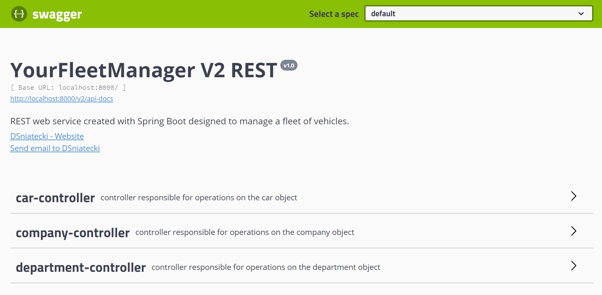
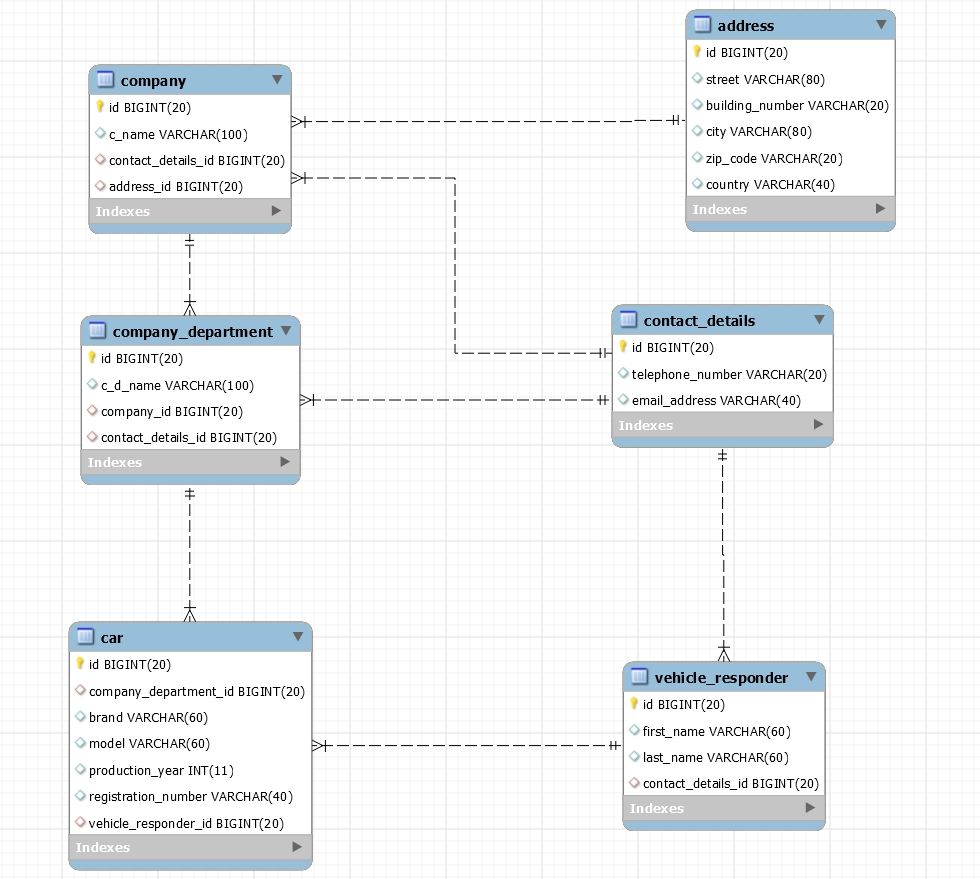

### YourFleetManager V2 REST
REST web service designed to manage a fleet of company vehicles. [ improved, REST version of YourFleetManger ]
The application was created in only two days.

## technology used :
 # - Backend :
     - Spring Boot
     - Spring MVC
     - Spring Data JPA
     - JPA & Hibernate
     - Lombok
     - MapStruct
     
 # - Tests :    
     - JUnit5
     - Mockito2
     
 # - Databases : 
     - H2 [ embedded ]
     - MySQL
     - PostgreSQl
     
 # - Documentation : 
     - Swagger2

 # Launching instruction :

  1.  Download 
  2.  Unzip 
  3.  Go to "SQL" folder and select the appropriate database schema 
  4.  Create database with this schema 
  5.  Load data into the database from the Data folder 
  6.  If you are using PostgreSQL database in application.properties change active profile to "postgresql", if you are using
      MySQL change to "mysql", if you are using H2 change to "h2"
  7.  In file application-mysql.properties, or application-postgresql.properties, or application-h2.properties ( depending on the   
      selected database ) enter correct database url, username and password ( for H2, you do not have to do it ). 
  8.  Run Application 
  10. Enjoy the management of your fleet of vehicles via JSON :)
 
 # Swagger2 :
  
  
 
 # Database diagram :
  
  
 
  
 
